  

# Hi, I'm Prasun Dutta 👋

**Data Engineer** · MSc Computer Science @ University of Bonn 🇩🇪

Learning to design and build end-to-end data pipelines - Spark processing, Airflow orchestration and Snowflake warehousing across Azure, Microsoft Fabric & AWS. On top of that, I am exploring building LLM agents with LangGraph, RAG systems, and MCP integrations. Currently deepening my expertise in Data Engineering and Applied AI at Masters level.

---

## 🔧 Tech Stack

**Data Engineering**

**AI & LLM**

**Cloud**

**Languages & Tools**

---

## 🚀 Featured Projects

### 🎵 [Spotify Data Pipeline v1 (Azure)](https://github.com/PrasunDutta007/Spotify-Datapipeline-Azure)
> End-to-end cloud data pipeline ingesting Spotify streaming data from SQL into a Bronze→Silver→Gold medallion architecture on Azure, with Databricks AutoLoader, Delta Live Tables, and SCD Type 1 & 2 served via Unity Catalog.

- **Ingestion**: SQL DB → Azure Data Factory (incremental CDC load) → Azure Data Lake (Bronze, Parquet)
- **Silver**: Databricks AutoLoader (Spark Structured Streaming) → cleansed Delta tables (dedup, transformations, duration flags)
- **Gold**: Delta Live Tables (DLT) → SCD Type 1 & 2 CDC flows → Unity Catalog gold layer (star schema)
- Built with: `Azure Data Factory` `Azure Data Lake` `Databricks` `Apache Spark` `Delta Live Tables` `Azure Key Vault` `Logic Apps`

---

### 🎧 [Spotify Data Pipeline v2 (AWS)](https://github.com/PrasunDutta007/Spotify-Datapipeline-AWS)
> End-to-end pipeline extracting Spotify playlist data via AWS Lambda, transforming it with AWS Glue (PySpark), auto-ingesting into Snowflake via Snowpipe, and orchestrating the full flow with Apache Airflow on Docker.

- **Extraction**: Spotify API → AWS Lambda (+ Spotipy Layer) → S3 raw JSON
- **Transformation**: AWS Glue (PySpark) → albums / artists / songs CSVs → S3 transformed
- **Loading**: Snowpipe (auto-ingest via SQS) → Snowflake tables
- **Orchestration**: Apache Airflow (Docker Compose, CeleryExecutor) → daily DAG
- Built with: `AWS Lambda` `AWS Glue` `Amazon S3` `Snowflake` `Apache Airflow` `Docker`

---

### 📈 [Stock Market Data Pipeline](https://github.com/PrasunDutta007/Stock-Market-Datapipeline)
> End-to-end production-grade pipeline ingesting real-time and historical stock data via AlphaVantage through dual batch and streaming architectures.

- **Batch**: AlphaVantage → Kafka → MinIO → Spark → Snowflake (Airflow orchestrated, daily schedule)
- **Streaming**: AlphaVantage → Kafka → MinIO → Spark Structured Streaming (15-min / 1-hr rolling windows)
- Built with: `Apache Kafka` `Apache Spark` `Apache Airflow` `Snowflake` `MinIO` `Docker Compose`

---

### 🏠 [Airbnb Data Pipeline (dbt)](https://github.com/PrasunDutta007/Airbnb-Datapipeline-dbt)
> Airbnb data pipeline using AWS S3, Snowflake, and dbt-core. Raw CSVs are staged into Snowflake and transformed through a Bronze→Silver→Gold medallion architecture with incremental loads, Jinja-driven OBT, SCD Type 2 snapshots, star schema, custom macros, and data quality tests.
 
- **Ingestion**: AWS S3 (CSV) → Snowflake External Stage → `COPY INTO` Staging
- **Transformation**: Bronze (raw incremental) → Silver (cleansed + macros) → Gold (OBT + Ephemeral + Snapshots + Fact)
- Built with: `dbt-core` `Snowflake` `AWS S3` `Python 3.12` `uv`
  
---

### 🎓 [Learning Management System (LMS) Data Pipeline (Microsoft Fabric)](https://github.com/PrasunDutta007/Learning-Management-System-Datapipeline-Fabric)
> End-to-end LMS data pipeline built on Microsoft Fabric. Daily CSV files flow through a Medallion Architecture (Raw → Landing → Bronze → Silver → Gold) via Fabric Pipelines and PySpark notebooks, building a star schema with incremental MERGE logic, and surfacing student performance analytics in a live Power BI dashboard.

- **Ingestion**: ADLS Gen2 (CSV) → Fabric Pipeline (GetMetadata + ForEach, daily schedule) → Date-partitioned Landing zone
- **Transformation**: Bronze (incremental Delta load) → Silver (dedup, null handling, business KPIs via MERGE) → Gold (Dim_student, Dim_course, Fact_student_performance)
- **Analytics**: Gold Lakehouse → Fabric Semantic Model → Power BI dashboard (grades, completion rates, performance scores)
- Built with: `Microsoft Fabric` `Azure Data Lake` `Apache Spark` `Delta Lake` `PySpark` `Power BI`

---

### 🤖 [Proxy-Meet: Intelligent Meeting Automation](https://github.com/PrasunDutta007/Proxy-Meet)
> Intelligent meeting automation system that acts as your proxy in Zoom - joining via a streamed OBS avatar, detecting your name and responding via voice and chat, recording the full session, and running a seven-agent CrewAI pipeline to push structured notes to Notion and a Minutes of Meeting draft to Gmail.
 
- **Meeting Bot**: Selenium-driven Zoom join → OBS virtual camera avatar → name detection → voice & chat auto-response → FFmpeg + VB-CABLE audio recording
- **Post-Processing**: AssemblyAI + Gemini 2.5 Pro transcription (speaker diarization) → 7-agent CrewAI pipeline (analysis, action items, formatting, QA, strategy, curation, email composition)
- **Delivery**: Dual-format structured notes → Notion database + Minutes of Meeting draft → Gmail | Streamlit post-meeting review dashboard
- Built with: `CrewAI` `Google Gemini 2.5 Pro` `AssemblyAI` `Selenium` `OBS Studio` `Notion API` `Gmail API` `Streamlit`
---

## 📊 GitHub Activity

<picture>
  <source media="(prefers-color-scheme: dark)" srcset="https://raw.githubusercontent.com/PrasunDutta007/PrasunDutta007/output/github-snake-dark.svg"/>
  <source media="(prefers-color-scheme: light)" srcset="https://raw.githubusercontent.com/PrasunDutta007/PrasunDutta007/output/github-snake.svg"/>
  
</picture>

---

## 📬 Connect

---

  

